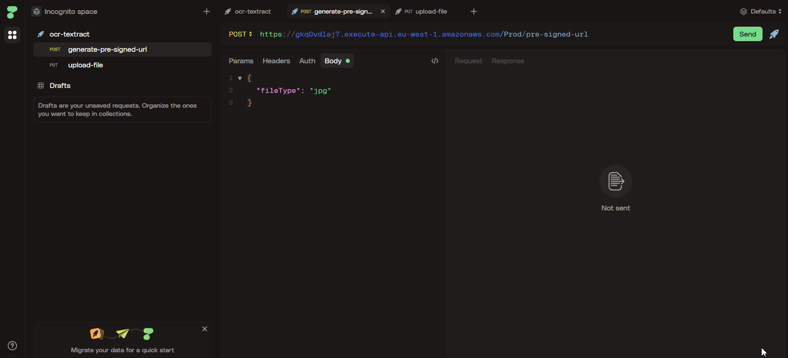
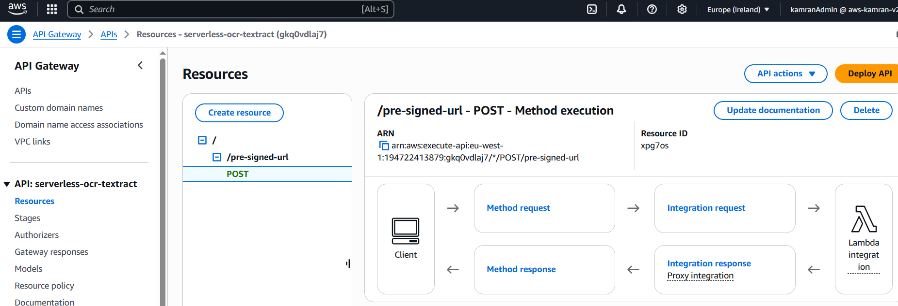
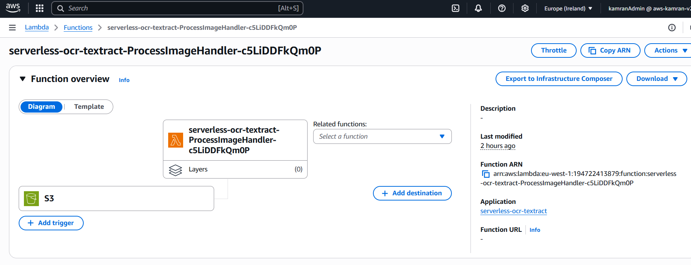

# 📝 Serverless OCR Text Extractor (AWS Textract)

[](https://www.oracle.com/java/)
[](https://aws.amazon.com/lambda/)
[](https://aws.amazon.com/api-gateway/)
[](https://aws.amazon.com/s3/)
[](https://aws.amazon.com/textract/)
[](https://aws.amazon.com/serverless/sam/)


> Many businesses still deal with scanned documents, invoices, and receipts. This app provides a way to extract text from those documents using AWS Textract. Upload a file and get structured text data back — useful for automating paperwork and bookkeeping.

---

## 📚 Table of Contents

- [Tech Stack](#-tech-stack)
- [Features](#-features)
- [Live Demo](#-live-demo)
- [API Endpoints](#-api-endpoints)
- [Deployment (via SAM)](#-deployment-via-sam)
- [Screenshots](#-screenshots)
- [Possible Improvements](#-possible-improvements)
- [Contact](#-contact)

---

## 🛠️ Tech Stack

- **Language:** Java 17
- **Build Tool:** Maven
- **Cloud Services:**
    - **AWS Lambda** – for serverless compute
    - **Amazon API Gateway** – REST API endpoints
    - **Amazon S3** – Image storage
    - **AWS Textract** – OCR text extraction
    - **AWS SAM** – infrastructure as code (IaC)

---

## 📌 Features

- 🔐 Pre-signed URL generation to securely upload images
- 📦 Lambda auto-triggered via S3 event notifications
- 📄 Text extracted from image using Textract’s `DetectDocumentText`

---

## 🧭 Live Demo



---

## 🔌 API Endpoints

### `POST /pre-signed-url`
Generate a pre-signed URL to upload a file.

- **Request Body:**
```json
{
  "fileType": "jpg"
}
```
- **Success Response:**
```json
{
  "uploadUrl": "https://s3-url",
  "key": "uploads/xyz.jpg"
}
```

---

## 🚀 Deployment (via SAM)

```bash
# 1. Build
sam build

# 2. Deploy
sam deploy --guided

```
---

## 🖼️ Screenshots

### 🚀 API Gateway


### ✅ Lambda - GeneratePreSignedUrlFunction


### 📦 Lambda - ProcessImageFunction


---

## 🧭 Possible Improvements

- 📝 Store results in DynamoDB or S3
- 🧪 Add API to fetch OCR results

---

## 📬 Contact

Built by **Kamran Zeynalov**

[](https://www.linkedin.com/in/zeynalov-kamran/)

